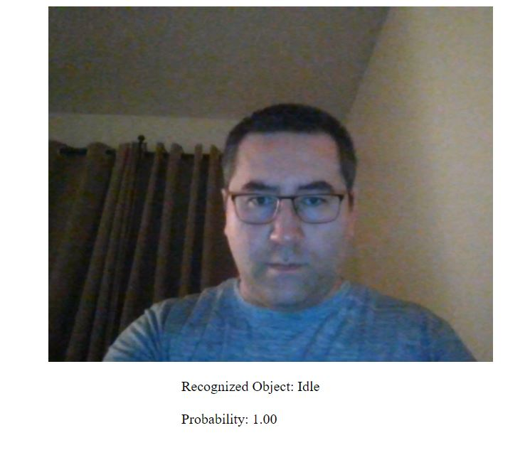

# TensorFlow.js Transfer Learning Image Classifier with Saving and Loading Features

### **Description / Rationale**
Transfer Learning Image Classifier codelab (https://codelabs.developers.google.com/codelabs/tensorflowjs-teachablemachine-codelab), unfortunately, does not provide the functionality for saving already trained image classifier for future use. As such, all trained images could be lost right after refreshing of the browser.    

Present application aims to fulfill this small gap by adding saving and loading capability for trained image classifiers.  

### **Features**
The application consist of two parts: 
1. train.html - It is used to train images for classification, save training results and test them.
2. load.html - It is used to load trained image classifier.

### **Usage**
**Local**
1. Copy the repository to your development environment.
2. Use "train.html" to train. After you are confident with the results save your image classification using transfer learning. A file will be generated with the name of "weights.json".
3. Refresh "train.html" page and load "weights.json" file to test if everything works ok.  
4. Put "weights.json" into the same folder, where this application is.
5. If test was successfull and previously trained images are recognized, use "load.html" file to load trained image classification. If necessary integrate it into your own code (together with main.js file).

**Web**
1. Copy the repository to your development environment.
2. Use "train.html" to train. After you are confident with the results save your image classification using transfer learning. A file will be generated with the name of "weights.json".
3. Refresh "train.html" page and load "weights.json" file to test if everything works ok.  
4. Put "weights.json" into the same folder, where this application is.
5. If test was successfull and previously trained images are recognized, put "weights.json" file into the same folder as the application on server. Use "load.html" file to load trained image classification.

### **Demo**
To see the application: [Demo application](https://tflearning.glitch.me)
